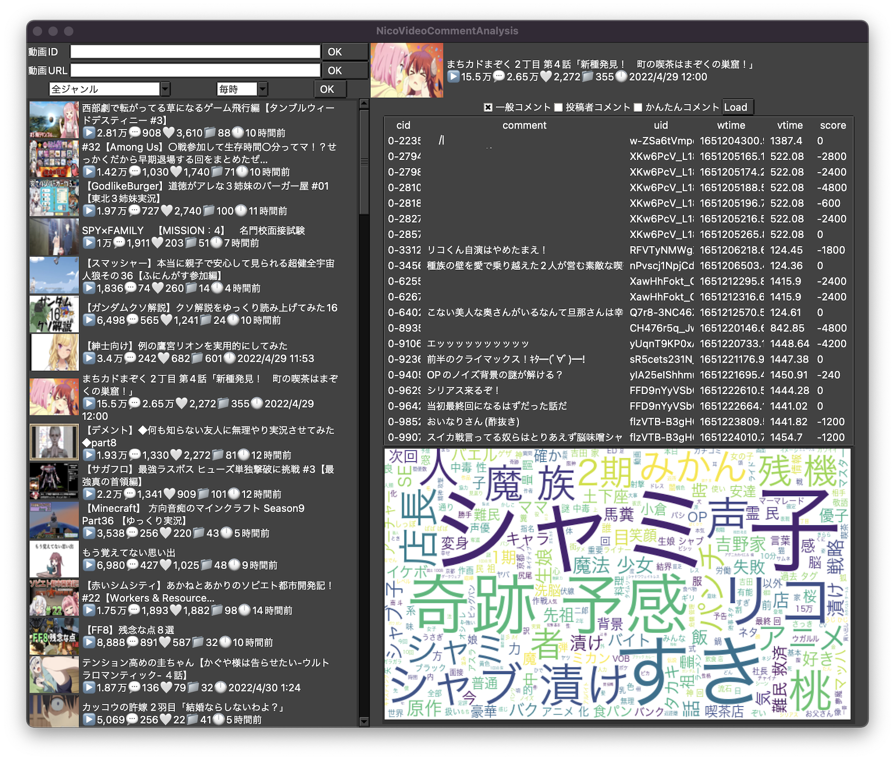

# Pythonでニコニコ動画のコメント取得と簡単な解析

## Memo
- コメントの読み込み部分は大体 OK
    - 総当り的に読み込んでいるので正直効率は悪い
    - コメントサーバになるべく負担をかけない実装にしたいところ
- WordCloud は形態素解析で取り出した名詞を解析の対象としている
    - 他の品詞対応はできたらやる
    - 傾向を掴むためなら名詞で十分な気はする
- doc2vec などを用いて動画ごとのコメント傾向分析とか少し試したりしている

## App
- Tkinter を用いてアプリケーション化してみた
    - 動画URL，IDを直接入力する他，ランキングから動画を取り込む機能を実装
    - コメントをロードしてから wordcloud で解析した結果を表示
    - 割としんどかったので，気が向いたら機能を実装していく感じで

