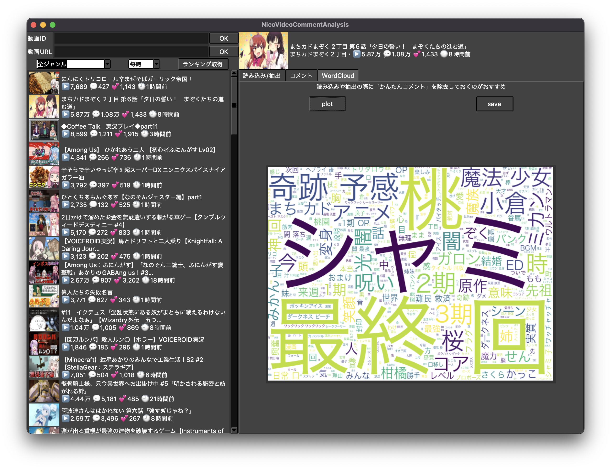

# Pythonでニコニコ動画のコメント取得と簡単な解析

## Memo
- コメントの読み込み部分は大体 OK
    - ~~総当り的に読み込んでいるので正直効率は悪い~~
        - 読み込めないコメントの原因が削除かたまたまか分からないのである程度妥協
        - あまりにもコメント数が多いと途中でアクセス遮断されてしまうため，対策が必要
            - 目安として，1万前後なら現状でもそこそこ平気
            - 簡単な対策として，待ち時間を入れる等の処理を加える予定
- WordCloud は形態素解析で取り出した名詞を解析の対象としている
    - 他の品詞対応はできたらやる
    - 傾向を掴むためなら名詞で十分な気はする
- doc2vec などを用いて動画ごとのコメント傾向分析とか少し試したりしている
    - 実装はアプリケーション化を進めてから考える
- 動画のコメントを取得し，分散表現にした上で，PCAで次元削減して2次元上にプロットすると，
動画の傾向とか見えてきたりしないだろうか
- 関数の型付け等，もう少しコードを整理してもいいかも

## App
- Tkinter を用いてアプリケーション化してみた
    - ~~GUIの実装は初めてだったのでコードがごちゃついた~~
- 各種機能
    - 動画URL，IDを直接入力する他，ランキングから動画を取り込む機能を実装
    - コメントの抽出機能を実装
    - コメント取得率等の情報を表示する機能を実装
    - コメント保存機能 (csv/pickle) と WordCloud の画像出力機能 (png/jpg) を実装
- UI 部分の改良や追加機能の実装など，おいおい行っていく
- MacOSアプリケーションとして試験的にパッケージ化 -> テストリリース
    - ちゃんと動作確認はしていないが，少なくとも自分の環境では動作を確認

