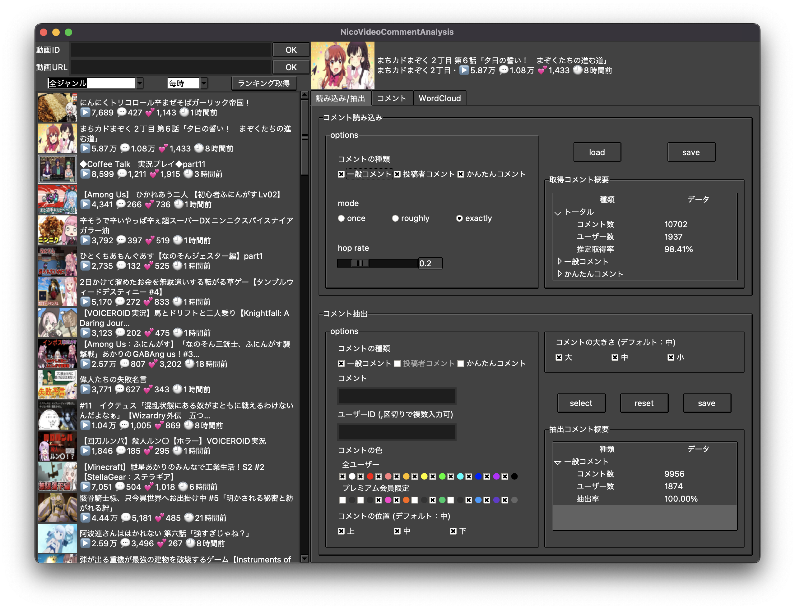

# Pythonでニコニコ動画のコメント取得と簡単な解析

## Memo
- コメントの読み込み部分は大体 OK
    - ~~総当り的に読み込んでいるので正直効率は悪い~~
        - 読み込めないコメントの原因が削除かたまたまか分からないのである程度妥協
- WordCloud は形態素解析で取り出した名詞を解析の対象としている
    - 他の品詞対応はできたらやる
    - 傾向を掴むためなら名詞で十分な気はする
- doc2vec などを用いて動画ごとのコメント傾向分析とか少し試したりしている
    - 実装はアプリケーション化を進めてから考える

## App
- Tkinter を用いてアプリケーション化してみた
    - 動画URL，IDを直接入力する他，ランキングから動画を取り込む機能を実装
    - コメントをロードしてから wordcloud で解析した結果を表示
    - GUIの実装は初めてだったのでコードがごちゃついた
- 条件によるコメント抽出や保存機能の実装，UI 部分の改良など，できたらやる
    - パッケージ化とかもう少し扱いやすい形にする所まではしたい

